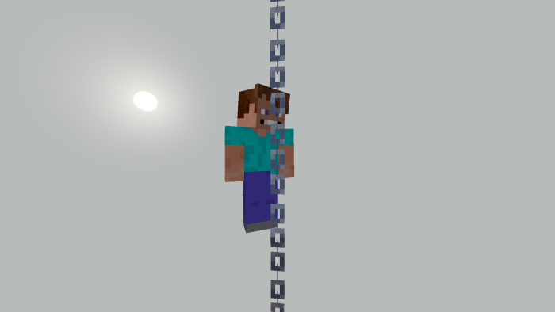

# Climbable Chains Addon

An addon for Minecraft: Bedrock Edition that allows you to climb up and down chains. This allows for some really interesting builds and concepts. 

_Someone climbing a chain._

### About the addon
To use it walk up to the chain facing forward and look up to go up and look down to go down. This uses the vanilla chain block.

_Video_

[Contributing Guide](./contributing.md)

[Licence](./licence.md)

[Download](https://github.com/Hatchibombotar/climbable-chains-addon/releases/download/latest-build/release.mcpack)