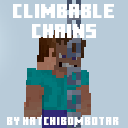

    
    <h1 style="text-align: center">Climbable Chains Addon</h1>
     

An addon for Minecraft: Bedrock Edition that allows you to climb up and down chains. This allows for some really interesting builds and concepts.

    <a href="./contributing.md">Contributing Guide<a>
     
    <a href="./licence.md">Licence</a>
    

----------------------

 
<a href="https://github.com/Hatchibombotar/climbable-chains-addon/releases/latest/download/release.mcpack" download>
<button style="font-size:20px;">Download!</button>
</a>
  

----------------------